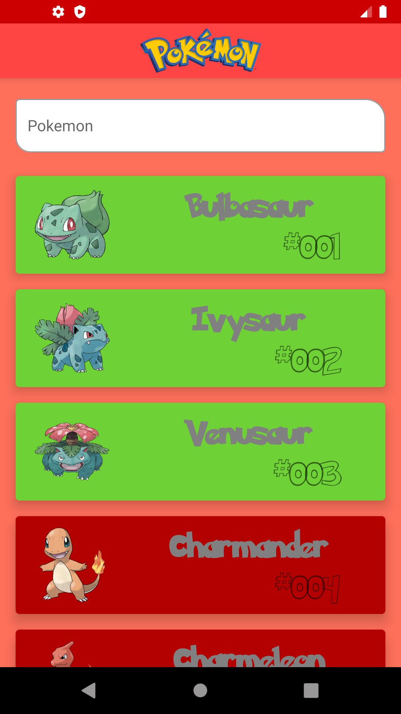
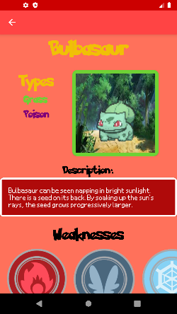
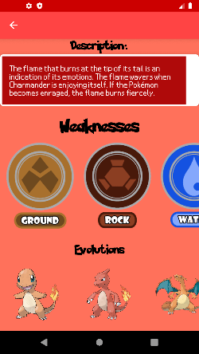

# Pokedex Kotlin

  The app intents to provide a dictionary about pokemon's, here you will find the project on version 1.1.0. For build it, i am
  using MVVM, retrofit to consult pokemons a raw JSON.
  
    

### IDE
* Android Studio

### Libs:

* Retrofit
* Retrofit
* Glide
* Kotlinx-coroutines-core
* Lifecycles
* Live Data
* Mockito kotlin
* core testing
#### Authorship
Jhonata Ávila, GitHub: [Joavilati](https://github.com/joavilati)
